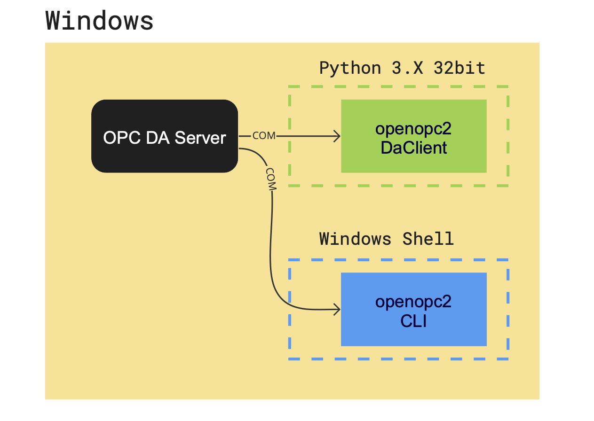
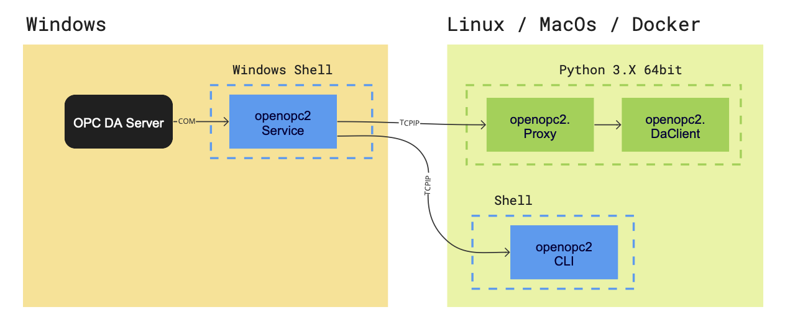

**OpenOPC 2**  is a Python Library for OPC DA. It is Open source and free for everyone. It allows you to use
[OPC Classic](https://opcfoundation.org/about/opc-technologies/opc-classic/) (OPC Data Access) in 
modern Python environents. OPC Classic is a pure Windows technology by design, but ths library includes a Gateway Server
that lets you use OPC Classic on any architecture (Linux, MacOS, Windows, Docker). So this Library creates a gateway 
between 2022 and the late 90ties. Like cruising into the sunset with Marty McFly in Tesla. 

OpenOpc 2 is based on the OpenOpc Library that was initially created by Barry Barnleitner an hosted on Source Forge, but
It was completely refactorerd and migrated to Python 3.8+


## Features

* An OpenOPC Gateway Service (a Windows service providing remote access 
to the OpenOPC library, which is useful to avoid DCOM issues).
* * Command Line Interface (CLI)
* Enables you to use OPC Classic with any Platform
* CLI and Gateway are independen Executables that do not require Python
* An OpenOPC for Python library module (used to connect to an OPC server 
from both Windows and Linux).
* A system check module (allows you to check the health of your system for performance).
* A free OPC automation wrapper (required DLL file).
* General documentation with updated procedures (this file).


## Localhost only, Windows Environment Setup

Use this setup requires a 32bit Python installation! because the OpcDLLs are 32bit. If you prefere working with a
64bit Python version you can simply use the With OpenOPC Gateway. 




`pip install openopc2
openopc2 --install`

## With OpenOpcGateway



`pip install openopc2
openopc2 --install`


## With DCOM

Theoretically it would be possibe to work with DCOM, but this is a pain in the neck and therefore not recommende or documented. 


## Installation


* Make sure these environment variables in your Windows box are set as 
shown:

```
OPC_CLASS=Matrikon.OPC.Automation;Graybox.OPC.DAWrapper;HSCOPC.Automation;RSI.OPCAutomation;OPC.Automation
OPC_CLIENT=OpenOPC
OPC_GATE_HOST=192.168.1.96    # IMPORTANT: Replace with your IP address
OPC_GATE_PORT=7766
OPC_HOST=localhost
OPC_MODE=dcom
OPC_SERVER=Hci.TPNServer;HwHsc.OPCServer;opc.deltav.1;AIM.OPC.1;Yokogawa.ExaopcDAEXQ.1;OSI.DA.1;OPC.PHDServerDA.1;Aspen.Infoplus21_DA.1;National Instruments.OPCLabVIEW;RSLinx OPC Server;KEPware.KEPServerEx.V4;Matrikon.OPC.Simulation;Prosys.OPC.Simulation
```

* If they are not set, open a command prompt window to do that by 
typing:

```
C:\>set ENV_VAR=VALUE
C:\>set OPC_GATE_HOST=172.16.4.22    # this is an example
```

* Make sure the firewall is allowed to keep the port 7766 open. If in 
doubt, and you're doing a quick test, just turn off your firewall 
completely.
* Keep in mind this scheme if you're still have questions about which 
packages are required and which ones are optional for you to work 
without issues (remember that Python is necessary on all platforms):

```
1. Win32 platform, using the OpenOPC Gateway Service

Pywin32:  optional
Pyro4:    required

2. Win32 platform, talking to OPC Servers directly using COM/DCOM

Pywin32:  required
Pyro4:    optional

3. Non-Windows platform (use of Gateway Service is mandatory)

Pywin32:  not applicable
Pyro4:    required
```

* For easy testing, make sure an OPC server is installed in your Windows 
box (i.e. Matrikon OPC Simulation Server).
* In order to get the most from the OpenOPC package, Windows developers 
are encouraged to install both Pywin32 and Pyro4. Using Pyro4 to talk to 
the Gateway Service provides a quick and easy method for bypassing the 
DCOM security nightmares which are all too common when using OPC.
* The work environment for testing these changes was a remote Debian 
Jessie box with a local Windows 7 Ultimate Service Pack 1 32-bit machine 
(where the Matrikon OPC Simulation Server was installed).


## Installation

### Getting Started

Begin to work with this project by doing this:

* Clone or download the repository as a `.zip` file.
* Extract the compressed file to a folder in your Windows box 
(i.e. `C:\OpenOPC37`).
* Open a command prompt window (run it as administrator) and go to your 
work directory (i.e. `C:\OpenOPC37`).
* Change to the `lib` folder.
* Register the OPC automation wrapper ( `gbda_aut.dll` ) by typing this 
in the command line:

```
C:\OpenOPC37\lib>regsvr32 gbda_aut.dll
```

* If, for any reason, you want to uninstall this file and remove it from 
your system registry later, type this in the command line:

```
C:\OpenOPC37\lib>regsvr32 gbda_aut.dll -u
```

### Install the OpenOPC Gateway Service

This goal can be achieved by running the "OpenOPCService.py" script with 
the Python interpreter and the "install" argument (remember to do it as 
administrator):

* In the command prompt window, go to your work directory 
(i.e. `C:\OpenOPC37`).
* Change to the `src` folder.
* Install the OpenOPC Gateway Service by typing this in the command 
line:

```
C:\OpenOPC37\src>python OpenOPCService.py install
```

* Wait while the following message is shown on the screen:

```
Installing service zzzOpenOPCService
Service installed
```


## Usage

### Start the OpenOPC Gateway Service

This task can be completed from one of two ways (make sure to have it 
installed first):

* By clicking the `Start` link on the "OpenOPC Gateway Service" from the 
"Services" window (Start -> Control Panel -> System and Security -> 
Administrative Tools).
* By running the `net start SERVICE` command like this:

```
C:\OpenOPC37\bin>net start zzzOpenOPCService
```

* If you have problems starting the service, you can also try to start 
this in "debug" mode:

```
C:\OpenOPC37\src>python OpenOPCService.py debug
```

### Stop the OpenOPC Gateway Service

This task can be completed from one of two ways:

* By clicking the `Stop` link on the "OpenOPC Gateway Service" from the 
"Services" window (Stop -> Control Panel -> System and Security -> 
Administrative Tools).
* By running the `net stop SERVICE` command like this:

```
C:\OpenOPC37\bin>net stop zzzOpenOPCService
```

### Configure the way the OpenOPC Gateway Service starts

If you are going to use this service frequently, it would be better to 
configure it to start in "automatic" mode. To do this:

* Select the "OpenOPC Gateway Service" from the "Services" window 
(Start -> Control Panel -> System and Security -> Administrative Tools).
* Right-click and choose "Properties".
* Change the startup mode to "Automatic". Click "Apply" and "OK" 
buttons.
* Start the service (if not already started).

### Implement the OpenOPC library module

Go [here](http://openopc.sourceforge.net/) for the basic implementation 
of the library. But, if you want updated procedures using Python 3.4+, 
see the wiki pages.


## Documentation

A PDF manual for OpenOPC is included in this repository inside the `doc` 
folder, written by the original author. Users are encouraged to also 
look at the [OpenOPC web site](http://openopc.sourceforge.net/) for 
additional usage examples that may not be contained in the manual.


## Credits

The authors of this package are:


```
Copyright (c) 2008-2012 by Barry Barnreiter (barry_b@users.sourceforge.net)
Copyright (c) 2014 by Anton D. Kachalov (mouse@yandex.ru)
Copyright (c) 2017 by José A. Maita (jose.a.maita@gmail.com)

```


## Contact

If you need technical assistance to implement this in a larger project, go 
to the main site [here](https://joseamaita.com/en/) or 
[here](https://joseamaita.com/en/contact-me/) for more detailed information.


## License

This software is licensed under the terms of the GNU GPL v2 license plus 
a special linking exception for portions of the package. This license is 
available in the `LICENSE.txt` file.
